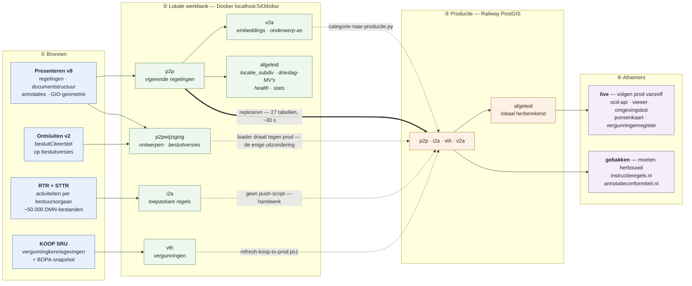
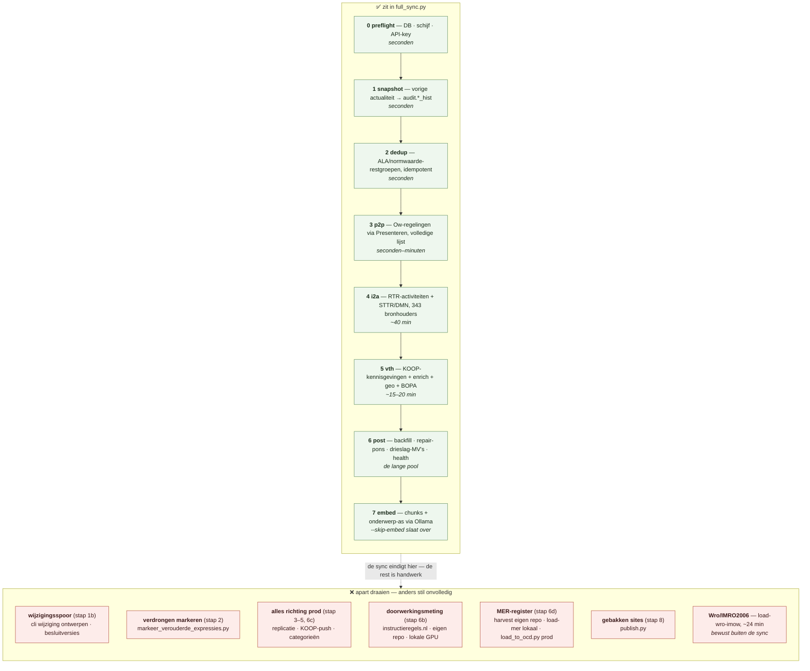
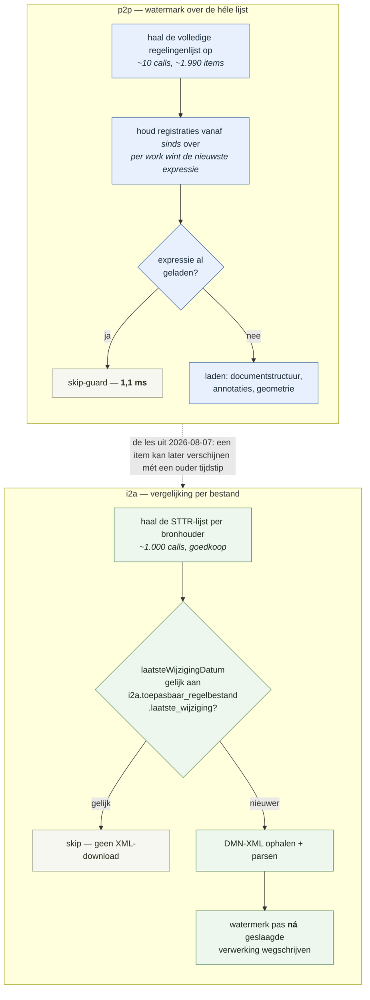
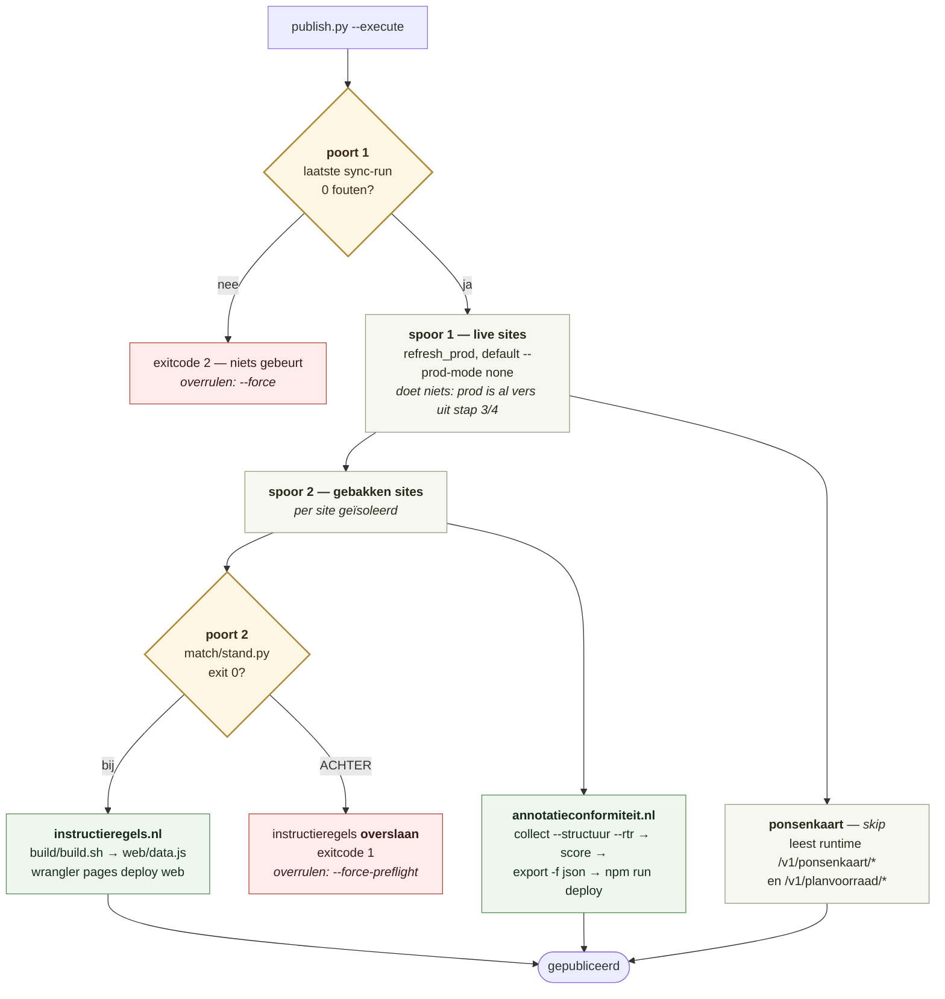
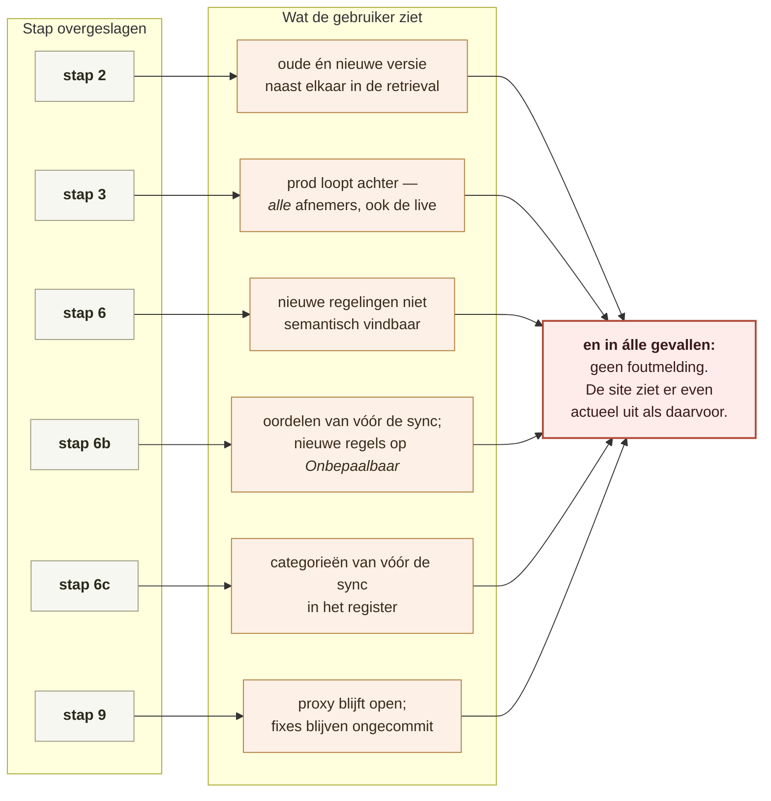
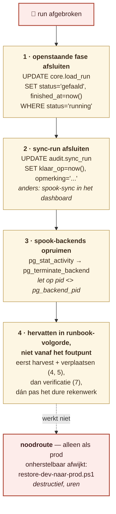
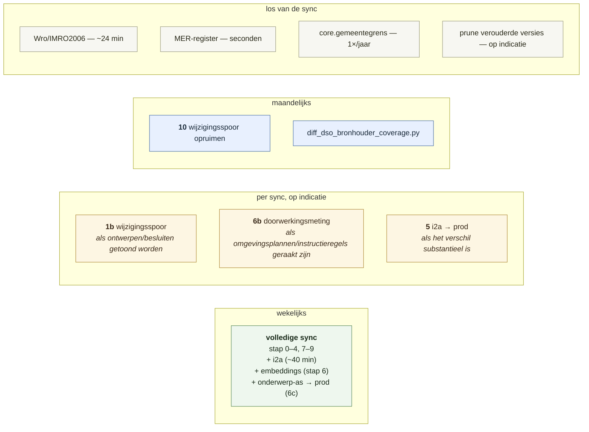

# Synchronisatie in beeld — wat er tijdens een sync gebeurt

*Opgesteld 2026-08-11. Visuele companion bij
[synchronisatie-runbook.md](synchronisatie-runbook.md).*

Drie documenten, drie rollen — verwar ze niet:

| Document | Beantwoordt | Wint bij tegenspraak over |
|---|---|---|
| [synchronisatieproces_beschrijving.md](synchronisatieproces_beschrijving.md) | *hoe werkt het* — mechaniek, delta's, API-zuinigheid | de werking |
| [synchronisatie-runbook.md](synchronisatie-runbook.md) | *hoe doen we het* — volgorde, go/no-go, commando's | de operatie |
| **dit document** | *wat gebeurt er eigenlijk* — de plaat, de datastromen, waar het stukgaat | niets — het is afgeleid |

Dit is bewust afgeleide documentatie. Staat hier iets dat het runbook
tegenspreekt, dan is dit document verouderd, niet het runbook.

---

## 1. De grote plaat

Vier bronnen, één werkbank, één productie-database, twee soorten afnemers.
De pijl die er het meest toe doet is de **dikke** in het midden: sinds
2026-08-08 gaan er *rijen* van lokaal naar prod, geen loaders.



**Waarom prod geen loaders draait** (gebruiker-keuze 2026-08-08): de bron wordt
één keer bevraagd in plaats van twee keer, lokaal en prod kunnen per definitie
niet uiteenlopen, en een API-hik halverwege kan productie niet half gevuld
achterlaten. De 80 GB `restore-dev-naar-prod` is de noodroute, niet de route.

### De twee databases zijn geen kopie van elkaar

| | Lokaal | Prod |
|---|---|---|
| Rol | werkbank: harvesten, evals, zware herbouw | wat eindgebruikers zien |
| Harvest | **hier, altijd** | nooit (behalve `p2pwijziging`) |
| Bereikbaar | altijd | alleen met de **TCP-proxy tijdelijk aan** |
| Parallelisme | normaal | uit — kleine `/dev/shm` in de container |
| Omvang | ~86,5 GB | ~59 GB |

Bekende, **bedoelde** verschillen — wie hier een afwijking ziet, ziet geen gat:

- `i2a`: lokaal 1.216.013 uitvoeringsregels op peildatum vandaag, prod 831.835
  op de april-stand. Openstaande keuze, geen datagat.
- `p2pwijziging`: stap 10 haalde lokaal 947.860 rijen weg die op prod nog staan.
- De replicatie **verwijdert** nooit iets op prod.

---

## 2. De volgorde — met de go/no-go-momenten

Elf stappen. Vier zijn optioneel of periodiek; de rest hoort bij elke sync.

```mermaid
flowchart TD
  S0["<b>0 · PREVIEW</b><br/>preview_sync.py --vergelijk-prod<br/><i>read-only · ~1 min</i>"]

  G0{"<b>go/no-go</b><br/>TE LADEN plausibel?<br/>VERDRONGEN? VERDWENEN?"}
  STOP["🛑 <b>Niet laden.</b><br/>0 te laden na weken = verdacht.<br/>Dit wás G-98."]

  S1["<b>1 · LOKAAL LADEN</b><br/>full_sync.py --label sync-datum<br/><i>p2p → i2a → vth → post · 1–5 u</i>"]
  S1B["<b>1b · WIJZIGINGSSPOOR</b><br/>cli wijziging ontwerpen + besluitversies<br/><i>zit NIET in full_sync · 20–60 min</i>"]
  S2["<b>2 · VERDRONGEN VERSIES</b><br/>markeer_verouderde_expressies.py<br/><i>~1 min · ná stap 1, nooit ervoor</i>"]

  PROXY(["🔌 TCP-proxy AAN"])

  S3["<b>3 · P2P → PROD</b><br/>repliceer_p2p_naar_prod.py --ja<br/>+ subdiv + MV's herbouwen<br/><i>20–40 min</i>"]
  S4["<b>4 · VTH → PROD</b><br/>refresh-koop-to-prod.ps1 -Push -Refresh -Verify<br/><i>~10 min</i>"]
  S5["<b>5 · I2A → PROD</b><br/><i>afweging — geen push-script</i>"]

  S6["<b>6 · EMBEDDINGS + ONDERWERP-AS</b><br/>cli refresh-v2a --ja --opruimen<br/><i>draait standaard mee in de sync</i>"]
  S6B["<b>6b · DOORWERKING</b><br/>instructieregels.nl · lokale GPU<br/><i>uren</i>"]
  S6C["<b>6c · ONDERWERP-AS → PROD</b><br/>categorie-naar-productie.py --ja<br/><i>~1 min</i>"]

  S7["<b>7 · VERIFICATIE</b><br/>preview opnieuw + regressiecheck<br/><i>~5 min</i>"]
  G7{"regressiecheck<br/>schoon?"}
  HERSTEL["↩︎ §4 Afbreken &amp; herstel<br/>hervat in <b>runbook-volgorde</b>,<br/>niet vanaf het foutpunt"]

  S8["<b>8 · DOWNSTREAM</b><br/>publish.py --execute<br/><i>~15 min</i>"]
  S9["<b>9 · NAZORG</b><br/>proxy dicht · VACUUM · rapport<br/>code committen op main<br/><i>~15 min</i>"]
  S10["<b>10 · WIJZIGINGSSPOOR OPRUIMEN</b><br/>ruim_wijzigingsspoor_op.py<br/><i>maandelijks, niet elke sync</i>"]

  KLAAR(["✅ klaar"])

  S0 --> G0
  G0 -->|verdacht| STOP
  G0 -->|akkoord| S1
  S1 --> S1B --> S2 --> PROXY --> S3 --> S4 --> S5 --> S6
  S6 --> S6B --> S6C --> S7 --> G7
  G7 -->|nee| HERSTEL --> S7
  G7 -->|ja| S8 --> S9 --> S10 --> KLAAR

  classDef verplicht fill:#eef7ee,stroke:#5a8a5a,stroke-width:2px,color:#1a2a1a
  classDef optioneel fill:#f7f7f2,stroke:#9a9a80,color:#2a2a1a
  classDef poort fill:#fdf6e3,stroke:#b08a3a,stroke-width:2px,color:#3a2a1a
  classDef fout fill:#fdecea,stroke:#b04a3a,stroke-width:2px,color:#3a1a1a
  class S0,S1,S2,S3,S4,S7,S8,S9 verplicht
  class S1B,S5,S6,S6B,S6C,S10 optioneel
  class G0,G7,PROXY poort
  class STOP,HERSTEL fout
```



### Het eerste principe: preview vóór elke schrijfactie

Geen fase draait zonder dat iemand heeft gezien wát hij gaat doen. De
aanleiding is concreet: de p2p-delta miste maandenlang regelingen terwijl elke
run "0 fouten" meldde (G-98).

> **Een groene rapportage betekent "geen exceptions", niet "correct".**

Drie signalen in de preview, en wat ze betekenen:

| Signaal | Betekenis | Actie |
|---|---|---|
| `TE LADEN` ≈ 0 na weken stilte | verdacht — dit wás G-98 | volledige lijst controleren |
| `VERDRONGEN > 0` | oude en nieuwe versie staan straks náást elkaar in de retrieval | stap 2 is **verplicht** |
| `VERDWENEN > 0` | work is weg uit de DSO | noteren, **niet** opruimen (G-91) — vervallen van rechtswege ≠ intrekking |

Leg de uitkomst vast in het sync-rapport. Zonder die vastlegging kun je
achteraf niet zien of de sync heeft geladen wát hij zou laden.

---

## 3. Wat `full_sync.py` wél en niet dekt

De naam misleidt op twee manieren. Hij laadt niets "vol" — elke fase is
incrementeel — en hij dekt het runbook maar voor een deel.



**Vlaggen van `full_sync.py`:**

| Vlag | Effect |
|---|---|
| `--label <naam>` | run-label in `audit.sync_run` |
| `--preview` | READ-ONLY: toon wat er geladen zou worden, en stop |
| `--sinds <ISO-UTC>` | ondergrens voor de p2p-delta forceren |
| `--full-p2p` | per-bronhouder-sweep i.p.v. de delta — **alleen** na een verse restore |
| `--skip-p2p` / `-i2a` / `-vth` / `-post` / `-embed` | fase overslaan |
| `--target local\|prod`, `--dsn`, `--yes` | prod-modus — **niet meer gebruiken** in een gewone sync |

`--sinds` is sinds 2026-08-08 niet meer nodig: de p2p-fase draait standaard over
de **volledige lijst**. Zie §5.

---

## 4. Waar de tijd heen gaat

Een reguliere wekelijkse sync, met de gemeten duren. Wat opvalt: het **laden**
is goedkoop, het **rekenen** is duur, en de dure rekenstappen staan achteraan.

```mermaid
gantt
  title Reguliere sync — gemeten duren (2026-08-08), geen wachttijden
  dateFormat HH:mm
  axisFormat %H:%M

  section Kijken
  0 · preview                        :done, p0, 00:00, 1m

  section Lokaal harvesten
  1 · p2p                            :active, p1, 00:01, 3m
  1 · i2a  (mét delta)               :active, p2, after p1, 40m
  1 · vth                            :active, p3, after p2, 18m
  1 · post — drieslag lokaal         :active, p4, after p3, 6m
  1b · wijzigingsspoor               :p5, after p4, 40m
  2 · verdrongen markeren            :p6, after p5, 1m

  section Naar productie
  3 · repliceren  (27 tabellen)      :crit, p7, after p6, 1m
  3 · subdiv + drieslag prod         :crit, p8, after p7, 22m
  3 · mv_geo_health                  :crit, p9, after p8, 7m
  4 · vth-push                       :crit, p10, after p9, 10m

  section Rekenen
  6 · refresh-v2a  (dirty-set)       :p11, after p10, 15m
  6c · onderwerp-as → prod           :p12, after p11, 1m

  section Afronden
  7 · verificatie                    :p13, after p12, 5m
  8 · downstream                     :p14, after p13, 15m
  9 · nazorg                         :p15, after p14, 15m
```



Niet in de balk hierboven, omdat het uren kost en van de lokale GPU afhangt:
**stap 6b** (doorwerkingsmeting). Eerste volledige cyclus 78 min screening +
107 min judge; bij een gewone sync een fractie daarvan door ~68% hergebruik van
bewijs-hashes.

### Vier keer dat een stap véél te veel deed

Het terugkerende patroon in dit runbook is niet "niet incrementeel" maar
**onvoorwaardelijk te veel werk**. Vier gevallen, alle vier opgelost of scherp
begrensd:

| Wat | Vóór | Na | Waarom het misging |
|---|---|---|---|
| `locatie_subdiv` | ≈ **3 u** | seconden | herbouw draaide per bronhouder, óók als alles werd overgeslagen |
| `naammatch_signaal` | ~82 min lokaal | **5,5 min** | vergeleek élke tekst in NL met élke objectnaam in NL — 6,3M treffers, waarvan 99,3% direct weggegooid |
| i2a DMN-downloads | **5,6 u** | ~40 min | geen delta: ~50.000 XML's per run opnieuw opgehaald |
| embed fase 4a | 139 min voor 574 van 1.979 | dirty-set van **26** | recursieve CTE over alle regelingen, ook waar niets veranderd was |

> Incrementeel maken bovenop een berekening die 147× te veel doet, verstopt het
> echte probleem. Eerst de scope, dan pas de delta.

---

## 5. De twee delta-mechanismen — bewust verschillend

p2p en i2a zijn allebei incrementeel, maar op een fundamenteel andere manier.
Dat is geen inconsistentie; het tweede is een reactie op wat er met het eerste
misging.



**Waarom p2p de hele lijst doet en niet stopt bij het eerste oudere item.** Tot
2026-08-01 vroeg de sweep `_sort=-registratietijdstip` en brak af bij het eerste
item ouder dan `sinds`. De lijst blijkt niet strikt gesorteerd:

```
1  2026-07-30  gm0779
2  2024-08-07  gm0984   ← hier brak de sweep af
3  2026-07-29  gm1963
4  2026-07-28  gm1900
```

Resultaat: **16 gemiste regelingen** over ruim een maand, terwijl elke sync "0
fouten" rapporteerde. `_sort` wordt nu bewust niet meer meegestuurd.

**Waarom `--sinds` daarna óók overbodig werd.** In de run van 2026-08-07 hadden
7 van de 10 te laden regelingen een `tijdstipRegistratie` van 2–10 juli, ruim
vóór de watermark van 29 juli. Ze waren ná de vorige run in de lijst verschenen
mét een oud tijdstip. Een watermark op registratietijdstip veronderstelt dat een
item zichtbaar wordt op het moment dat het geregistreerd is — en dat klopt niet.
Het kost ook niets: de lijst wordt hoe dan ook volledig gepagineerd.

**Twee eigenschappen van het i2a-watermerk om te kennen:** de datum wordt pas
vastgelegd *ná* geslaagde verwerking (een afgebroken run laat dus geen bestand
achter dat ten onrechte als "bij" geldt), en verdwenen regelbestanden worden
niet opgeruimd — dezelfde keuze als G-91.

### Peildatum en delta zijn elkaars voorwaarde

RTR en STTR zijn **geldigheidsgestuurd**: de `datum`-parameter bepaalt welke
toestand je terugkrijgt. Die stond op drie plekken hardgecodeerd op
`10-04-2026`, nu `_peildatum()` = vandaag (te overschrijven met
`IMTR_PEILDATUM`).

> De peildatum bepaalt **wat er gevraagd wordt**, de delta bepaalt **wat daarvan
> opnieuw wordt opgehaald.** Zonder delta zou de peildatum-fix de fase weer 5,6
> uur maken; zonder peildatum-fix zou de delta een steeds sneller antwoord op
> een steeds oudere vraag geven.

---

## 6. Stap 3 uitvergroot — kopiëren versus herbouwen

Deze scheiding is niet cosmetisch: hij bepaalt of stap 3 twintig minuten of een
nacht kost. `p2p` is lokaal **24 GB**, maar tien nieuw geladen regelingen
beslaan 14.100 `tekst_element` + 6.489 `juridische_regel`. De brondata past in
een handvol COPY's; de omvang zit in afgeleide objecten die je nooit over de
lijn moet sturen.

```mermaid
flowchart LR
  SET["<b>① Bepaal de set</b><br/>SELECT frbr_expression<br/>FROM p2p.regeling_load<br/>WHERE geladen_op &gt;= run-start"]

  subgraph KOPIE["② Kopiëren — over de lijn"]
    K1["p2p.regeling<br/>tekst_element<br/>juridische_regel"]
    K2["locatie · activiteit<br/>gebiedsaanwijzing · kaart<br/>geo_informatieobject"]
    K3["junction-tabellen<br/>p2p.regeling_load"]
  end

  VLAG["<b>③ Inactief-vlaggen gelijktrekken</b><br/>uit stap 2 — anders staan oude én<br/>nieuwe versie op prod in de retrieval"]

  subgraph HERB["④ Herbouwen — op prod zelf"]
    H1["locatie_subdiv<br/><i>12 GB lokaal · ST_Subdivide</i><br/>alleen geraakte bronhouders"]
    H2["drieslag-MV's<br/><i>21,6 min in 8 stappen</i>"]
    H3["health + stats<br/><i>mv_geo_health 6,2 min</i>"]
  end

  VER["<b>⑤ Verifiëren</b><br/>tellingen aan beide kanten,<br/>gefilterd op dezelfde expressie-set"]

  SET --> KOPIE --> VLAG --> HERB --> VER

  classDef stap fill:#fdf6e3,stroke:#b08a3a,stroke-width:2px,color:#3a2a1a
  classDef kop fill:#e8f0fe,stroke:#4a6fa5,color:#1a2a3a
  classDef her fill:#fdf0e6,stroke:#b07b3a,color:#3a2a1a
  class SET,VLAG,VER stap
  class K1,K2,K3 kop
  class H1,H2,H3 her
```



`locatie_subdiv` meesturen zou in z'n eentje meer dan de helft van het
p2p-volume over de proxy duwen, voor geometrie die prod in seconden per
bronhouder zelf berekent.

### Vier valkuilen in `repliceer_p2p_naar_prod.py`

Elk van deze vier ging bij de eerste run mis. Ze zitten nu in het script, maar
wie zelf iets repliceert loopt ertegenaan:

| Valkuil | Wat er gebeurde | Fix |
|---|---|---|
| `ON CONFLICT DO NOTHING` | IMOW-objecten houden hun `identificatie` maar krijgen een nieuwe `regeling_expression` → lokaal 6.489 juridische regels, op prod **244** | `DO UPDATE` — lokaal is de waarheid |
| identity-kolommen | prod deelt nieuwe `tekst_element.id` uit → `tekst_inline_referentie` en `v2a.tekst_embedding` wijzen naar andere tekst | `OVERRIDING SYSTEM VALUE` + sequence mee |
| generated kolommen | `inhoud_plain` is stored generated; invoegen is een harde fout | kolomlijst opbouwen, geen `LIKE` |
| `FORMAT BINARY` | lokaal PG 16.9/PostGIS 3.5, prod PG 17.10/PostGIS 3.7 | `FORMAT TEXT` |

**En één die niet in het script zit:** parallellisme. `get_conn()` zet het bij
een prod-DSN vanzelf uit, maar wie rechtstreeks met `psql` verbindt moet het
zelf doen. Gemeten op `core.mv_bronhouder_health`: mét parallellisme *"could not
resize shared memory segment"*, zonder **16,2 s**.

---

## 7. Stap 8 uitvergroot — de twee poorten van `publish.py`

Live sites volgen prod vanzelf. Gebakken sites moeten herbouwd, en daar zitten
twee onafhankelijke poorten voor.



**Waarom twee vlaggen en niet één.** Als `--force` beide poorten dekte, zou
iedereen die langs een rode sync-status moet — en dat is vaker dan je denkt —
de doorwerkingspoort ongemerkt meesleuren.

**Waarom poort 2 überhaupt bestaat.** De doorwerkings-oordelen op
instructieregels.nl komen niet uit de loader maar uit een aparte pijplijn in
`c:/GIT/instructieregels.nl/match/` — sinds 2026-08-22 gesplitst: screening
lokaal op Ollama, het oordeel op Sonnet via subagent-fan-out. Zonder poort bouwt
`publish.py` de site na een sync gewoon opnieuw, met oordelen van vóór die sync
— en zonder één foutmelding, want de tabellen zijn gevuld, alleen niet meer
actueel.

**`publish.py` ververst prod niet.** `--prod-mode` staat default op `none`;
`delta` is een TODO-stub die alleen een regel print en terugkeert, en `restore`
roept de zware destructieve `restore-dev-naar-prod.ps1 -All` aan. Prod hoort op
dit punt al vers te zijn uit stap 3 en 4 — gebruik `--prod-mode` daar niet als
vangnet voor.

**De registry** (`sites()`) kent drie sites: **ponsenkaart** (live, `skip`),
**instructieregels** en **annotatieconformiteit** (beide baked). RoM staat er
niet in — buiten scope sinds 2026-07-24. Runbook stap 8 en de docstring van
`publish.py` noemden RoM ten onrechte; beide zijn op 2026-08-11 gelijkgetrokken
met de code.

---

## 8. Wat er stil misgaat

De rode draad door dit hele runbook: de gevaarlijke fouten zijn niet de
exceptions maar de **stille onvolledigheid**. Alles hieronder levert een groene
run op.



### De regressiecheck is het tegengif

`SYNC-REPORT-<datum>.md` opent met een sectie **Regressiecheck**. Die vergelijkt
niet of een fase *gedraaid* heeft maar of hij iets *deed*, op basis van
`details.totaal_voor` / `totaal_na` per `core.load_run`:

| Signaal | Betekenis |
|---|---|
| totaal **daalde** | data verdwenen tijdens een fase die "ok" meldt |
| preview verwachtte +N, geladen +M (M < N) | stille onvolledigheid bínnen deze run |
| 3 runs op rij geen aangroei | de bron staat stil — dit is het i2a-geval (G-117) |

Retroactief getest: de check vindt zowel G-98 (`ozon-regelingen` drie runs stil)
als G-117 (`rtr-toepasbare-regels` stil op 63.792). Losse controle op een
eerdere run: `python -m src.sync_regressie --run-id <n>`.

### Twee gaten die de check níét ziet

- **Verschoven top-K** (stap 6b). `stand.py` kan niet zien dat een nieuw
  omgevingsplan-artikel inmiddels in de top-K van een bestaande instructieregel
  zou vallen. Vuistregel: laadde stap 1 nieuwe of gewijzigde omgevingsplannen,
  draai dan 1a–1d ongeacht wat `stand.py` zegt.
- **Chunks van verdrongen expressies** (G-97). De vectorlaag voegt alleen toe en
  ruimt niets op; de onderwerp-as zeeft ze bij het lezen weg. Bij `gm0796`
  bestond **45%** van de geclassificeerde wId's niet meer in de versie op het
  scherm. Geen fout, maar een oplopende schuld — `refresh-v2a --opruimen`
  adresseert het.

---

## 9. Afbreken en herstel

Een gekilde run laat drie soorten rommel achter.



**Herstarten is veilig** — alle fasen zijn idempotent: skip-guard op p2p,
`ON CONFLICT` op i2a, watermark op vth, resumable embed.

**Een afgekapte MV-refresh laat een spook-backend achter.** `subprocess.run`
kilt de client, maar de Postgres-backend merkt dat pas bij zijn volgende
netwerkactie en rekent rustig door — aan werk dat gegarandeerd verloren gaat,
want de `COMMIT` komt nooit. Ondertussen kost hij IO en houdt hij de lock vast.

Let bij het opruimen op `pid <> pg_backend_pid()`: zoek je op querytekst, dan
matcht je eigen query zichzelf en beëindig je je eigen sessie. Gebeurd op
2026-08-01.

---

## 10. Cadans

Niet elke stap hoort bij elke sync.



---

## 11. Openstaande beperkingen

Wat dit runbook nog niet oplost, gerangschikt naar wat het kost.

| # | Beperking | Gevolg |
|---|---|---|
| **G-97** | vectorlaag herbouwt volledig en ruimt niets op | chunks van verdrongen expressies blijven staan; 45% bij `gm0796` wordt bij het lezen weggezeefd |
| **G-91** | verdwenen regelingen worden gedetecteerd maar niet opgevolgd | 11 vigerende regelingen in de DB die de DSO niet meer toont |
| **G-94** | vth heeft geen delta; scheduling ontbreekt | stap 4 en 5 blijven handwerk |
| **G-123** | de relevantietoets van `ontwerp_loader` geldt alleen bij intake | rijen komen binnen onder een voorwaarde en vertrekken niet als die vervalt; stap 10 ruimt op, de loader bouwt het weer op |
| — | geen replicatiestap voor `p2pwijziging` | de enige plek waar een loader tegen prod draait |
| — | afgeleide herbouw in stap 3 is nog losse commando's | één script plus drie handmatige stappen |
| — | replicatie verwijdert nooit iets op prod | lokaal opgeruimde rijen blijven daar staan |
| — | **rapportage meet exceptions, geen volledigheid** | "0 fouten" gaf jarenlang valse geruststelling |

> **De laatste is de belangrijkste openstaande verbetering.** Het rapport zou
> *verwacht* (uit de preview) naast *daadwerkelijk geladen* moeten zetten en
> afwijkingen markeren. Dan was G-98 in juni opgevallen in plaats van in
> augustus — en dan meet ook de `publish.py`-poort iets zinnigs.

---

## Bijlage — commando's op een rij

```bash
cd c:/GIT/OCD/dso-loader

# 0 · preview (read-only)
python scripts/preview_sync.py --vergelijk-prod
python scripts/preview_sync.py --i2a                    # optioneel, ~342 calls

# 1 · lokaal laden
python scripts/full_sync.py --label "sync-<datum>" --skip-embed

# 1b · wijzigingsspoor (zit NIET in full_sync)
python -m src.cli wijziging ontwerpen
python -m src.cli wijziging besluitversies

# 2 · verdrongen versies markeren
python scripts/markeer_verouderde_expressies.py

#    ── TCP-proxy AAN in het Railway-dashboard ──

# 3 · p2p → prod
python scripts/preview_sync.py --target prod            # read-only: wat mist prod?
python scripts/repliceer_p2p_naar_prod.py               # droogloop
python scripts/repliceer_p2p_naar_prod.py --ja
OCD_DB_URL="$PROD_DB_URL" python -m src.cli refresh-subdiv -b <code>
OCD_DB_URL="$PROD_DB_URL" python scripts/refresh_drieslag.py
psql "$PROD_DB_URL" \
  -c "SET max_parallel_workers_per_gather = 0" \
  -c "SET max_parallel_maintenance_workers = 0" \
  -c "REFRESH MATERIALIZED VIEW core.mv_bronhouder_health" \
  -c "REFRESH MATERIALIZED VIEW core.mv_geo_health" \
  -c "REFRESH MATERIALIZED VIEW v2a.ponsenkaart_gemeente_stats"

# 4 · vth → prod
powershell -File scripts/refresh-koop-to-prod.ps1 -Push -Refresh -Verify -ProdUrl "<PROD_DB_URL>"

# 6 · embeddings + onderwerp-as
python -m src.cli refresh-v2a                           # droogloop: toon de dirty-set
python -m src.cli refresh-v2a --ja --opruimen

# 6b · doorwerkingsmeting (andere repo)
cd c:/GIT/instructieregels.nl
PYTHONUTF8=1 python match/stand.py                      # 0 = bij, 1 = achter, 2 = onbepaalbaar

# 6c · onderwerp-as → prod
cd c:/GIT/OCD/dso-loader
python scripts/2026-08-06-categorie-naar-productie.py   # droogloop
python scripts/2026-08-06-categorie-naar-productie.py --ja

# 7 · verificatie
python scripts/preview_sync.py --vergelijk-prod         # moet nu ~0 tonen
python -m src.sync_regressie --run-id <n>

# 8 · downstream
python scripts/publish.py                               # dry-run (default)
python scripts/publish.py --execute

#    ── TCP-proxy UIT ──

# 10 · periodiek
python scripts/ruim_wijzigingsspoor_op.py               # droogloop
python scripts/ruim_wijzigingsspoor_op.py --uitvoeren
```
